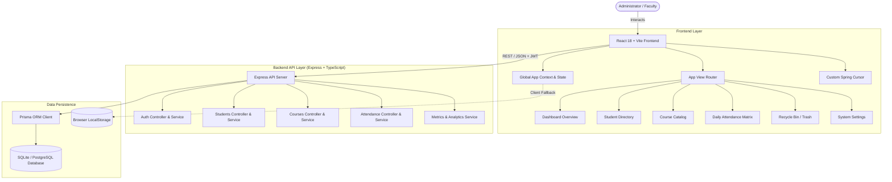

# EduCRM — Technoglobe PRO

<div align="center">


### *An Enterprise-Grade, Modern & Minimal Student Information and Course CRM*

[](https://reactjs.org/)
[](https://vitejs.dev/)
[](https://www.typescriptlang.org/)
[](https://tailwindcss.com/)
[](https://nodejs.org/)
[](https://expressjs.com/)
[](https://www.prisma.io/)
[](LICENSE)

[Features](#-key-features) • [Architecture](#-system-architecture) • [Getting Started](#-getting-started) • [Default Credentials](#-default-credentials) • [API Reference](#-api-endpoints)

</div>

---

## 📖 Overview

**EduCRM** (Technoglobe PRO) is a production-grade Educational Resource Management and Student CRM platform designed with high-end editorial aesthetics, micro-interactions, and institutional automation.

Built to replace archaic student tracking tools, EduCRM unifies **admissions, curriculum planning, daily attendance roll call, faculty mentorship, recycle-bin recovery, and executive analytics** within an intuitive, responsive interface styled with signature brand coral (`#FF5B26`) on high-contrast canvas backgrounds.

---

## ✨ Key Features

### 🔐 1. Luxury Editorial Authentication
- **Split-Hero Design**: Left-panel interactive 3D botanical sculpture artwork reacting dynamically to mouse movement with spring parallax physics.
- **Minimalist Pill Forms**: Seamless switching between **Sign In** and **Register** modes.
- **Admin Fast Pass**: Single-click demo credentials autofill with confetti celebration.
- **JWT Session Security**: Secure token issuance, password hashing via bcrypt, and role authorization.

### 🪄 2. Custom Spring Physics Cursor (`CustomCursor`)
- **Dual Element Tracking**: Center pinpoint coral dot with zero latency paired with an outer spring-damped ring.
- **Magnetic Hover Scaling**: Automatically scales to 2x when hovering over interactive buttons, cards, and navigation items.
- **Controllable & Touch-Safe**: Automatically suppressed on touch devices and toggleable from the Settings panel.

### 👥 3. Student Lifecycle & Graduation Engine
- **Automated End-Date Calculus**: Automatically calculates exact course completion dates (`startDate + course.durationMonths`).
- **Dynamic Status Derivation**: Automatically flags students as `UPCOMING`, `ACTIVE`, or `COMPLETED`.
- **Student Profile Dossier**: Detailed student records displaying enrolled curriculum, faculty mentor, check-in history, and performance.
- **Single-Click Edit & Soft Delete**: Update records on the fly or move them safely to the Recycle Bin.

### 📚 4. Modular Course & Syllabus Catalog
- **Classifications**: Distinct tracks for **Technical** (Full Stack, Cyber Security, Cloud DevOps) and **Non-Technical** (UI/UX Design, Product Strategy).
- **Interactive Syllabus Tags**: Live chip management for course modules and topics.
- **Course Enrollment Tracking**: Real-time counts of active students per curriculum.

### 📅 5. Daily Attendance Matrix & Intelligence
- **Dual View Modes**: Switch between **All Students State** and **Course-Wise View** with quick 1-click filter badges.
- **Syllabus Subject Visibility**: Every student row displays their enrolled course's syllabus subjects as clean chips.
- **Overall Attendance Analytics**:
  - Live institutional attendance consistency rate gauge.
  - Daily roll-call counts (Present, Late, Absent).
  - Academic attendance risk meter flagging students below institutional thresholds.
- **Custom Popover Calendar (`CustomDatePicker`)**: Custom date picker replacing all native browser inputs.

### 🗑️ 6. Recycle Bin & Trash System (`TrashView`)
- **Soft-Delete Architecture**: Deleting students or archiving courses moves them to a persistent recycle bin.
- **Single-Click Restoration**: Restore items back to active rosters instantly without data loss.
- **Permanent Purge Protection**: Permanent deletion with confirmation safeguards and an **"Empty Trash"** bulk action.
- **Live Dock Badging**: Real-time counter badge in the sidebar dock showing trashed items.

### ⚙️ 7. Comprehensive Settings & Data Portability
- **Institute Identity**: Customize academy name, tagline, support hotline, address, currency symbol, and timezone.
- **Academic Rules**: Configure minimum attendance warning thresholds (%) and default course durations.
- **Theme & Appearance**: Instant toggle between high-contrast **Dark Matte** (`#0E1012`) and **Light Clean** canvas.
- **1-Click Backup Export**: Download a verified JSON snapshot containing all students, courses, attendance logs, and system settings.

### 🎛️ 8. Bespoke Custom Components
- **`CustomDropdown`**: Smooth Framer Motion animated dropdowns with search filtering, keyboard dismissal, and active checkmarks (Zero native `<select>` elements).
- **`CustomDatePicker`**: Month/year navigation, weekday grid, and today shortcut (Zero raw `<input type="date">` elements).

---

## 🏗 System Architecture



---

## 📂 Project Structure

```
EduCRM/
├── frontend/                     # Modern React + Vite Frontend
│   ├── public/                   # Static assets & illustrations
│   ├── src/
│   │   ├── assets/               # Botanical artwork & graphics
│   │   ├── components/
│   │   │   ├── attendance/       # Daily attendance matrix & analytics
│   │   │   ├── auth/             # Split-screen luxury login & registration
│   │   │   ├── common/           # CustomCursor, CustomDropdown, CustomDatePicker
│   │   │   ├── courses/          # Course catalog, create & edit modals
│   │   │   ├── dashboard/        # Bento metrics, balance cards & Recharts
│   │   │   ├── layout/           # Floating SidebarDock & TopNavbar
│   │   │   ├── professors/       # Faculty mentor rosters & add modal
│   │   │   ├── settings/         # Multi-tab institute settings & export
│   │   │   ├── students/         # Student directory, detail & edit modals
│   │   │   └── trash/            # Recycle bin view for soft-deleted items
│   │   ├── context/              # AppContext & AuthContext
│   │   ├── data/                 # Seed data with INR currency formatting
│   │   ├── types/                # TypeScript interfaces & domain models
│   │   ├── utils/                # Date calculation & validation utilities
│   │   ├── App.tsx               # Root view router & dock offset
│   │   └── main.tsx              # React entry point
│   └── package.json
│
├── backend/                      # Node.js + Express REST API
│   ├── prisma/
│   │   └── schema.prisma         # Relational schema (Student, Course, Attendance)
│   ├── src/
│   │   ├── middlewares/          # JWT auth guard & Zod validation
│   │   ├── modules/              # Auth, Students, Courses, Attendance, Dashboard
│   │   ├── utils/                # Date math & status derivation utilities
│   │   └── server.ts             # Express server setup
│   ├── .env.example              # Environment variable template
│   └── package.json
│
└── README.md                     # Documentation
```

---

## 🚀 Getting Started

### Prerequisites
- **Node.js**: v18.0.0 or higher
- **npm** or **yarn** / **pnpm**
- **Git**

---

### 1. Clone the Repository
```bash
git clone https://github.com/YogeshTundiya/EduCRM.git
cd EduCRM
```

---

### 2. Run the Frontend
```bash
# Navigate to frontend
cd frontend

# Install dependencies
npm install

# Start the Vite development server
npm run dev
```

The frontend will run at **`http://localhost:5173`**.

---

### 3. Run the Backend API (Optional / Full-Stack)
```bash
# In a separate terminal, navigate to backend
cd backend

# Install dependencies
npm install

# Setup environment variables
cp .env.example .env

# Initialize database schema
npx prisma db push

# Seed initial courses, faculty, and student rosters
npx ts-node src/prisma/seed.ts

# Start the development server
npm run dev
```

The REST API server will run at **`http://localhost:5000`** (`/api/v1`).

---

## 🔑 Default Credentials

When launching the application for the first time, you can log in with:

| Role | Email | Password | Quick Action |
|---|---|---|---|
| **System Administrator** | `admin@technoglobe.com` | `admin123` | Click **"1-Click Fill Admin"** on the login card |

---

## 📡 API Endpoints

| Method | Endpoint | Description | Auth Required |
|---|---|---|---|
| `POST` | `/api/v1/auth/login` | Authenticate user & issue JWT tokens | No |
| `POST` | `/api/v1/auth/register` | Register new admin or faculty staff | No |
| `GET` | `/api/v1/students` | List all students with course details | Yes |
| `POST` | `/api/v1/students` | Enroll student & calculate graduation date | Yes |
| `PATCH`| `/api/v1/students/:id` | Update student profile & recompute dates | Yes |
| `DELETE`| `/api/v1/students/:id` | Move student to Recycle Bin | Yes |
| `GET` | `/api/v1/courses` | List courses with syllabus modules | Yes |
| `POST` | `/api/v1/courses` | Create new course curriculum | Yes |
| `GET` | `/api/v1/attendance` | Get attendance marks by course & date | Yes |
| `POST` | `/api/v1/attendance` | Record student attendance status | Yes |
| `GET` | `/api/v1/dashboard/metrics` | Aggregate KPI statistics & income data | Yes |

---

## 🛠 Tech Stack

| Domain | Technologies |
|---|---|
| **Frontend Core** | React 18, TypeScript, Vite |
| **Styling & Effects** | Tailwind CSS, Framer Motion, Vanilla CSS Tokens |
| **Data Visualization** | Recharts, Lucide Icons, Canvas Confetti |
| **Backend Core** | Node.js, Express.js, TypeScript |
| **Database & ORM** | Prisma ORM, SQLite (Dev) / PostgreSQL (Prod) |
| **Security** | JSON Web Tokens (JWT), bcryptjs, Zod Schema Validation |

---

## 🤝 Contributing

Contributions are welcome! Please feel free to submit a Pull Request.

1. Fork the Project (`https://github.com/YogeshTundiya/EduCRM/fork`)
2. Create your Feature Branch (`git checkout -b feature/AmazingFeature`)
3. Commit your Changes (`git commit -m 'Add some AmazingFeature'`)
4. Push to the Branch (`git push origin feature/AmazingFeature`)
5. Open a Pull Request

---

## 📄 License

Distributed under the **MIT License**. See `LICENSE` for more information.

---

<div align="center">
  <sub>Crafted with passion by <a href="https://github.com/YogeshTundiya">Yogesh Tundiya</a> for modern academic excellence.</sub>
</div>
